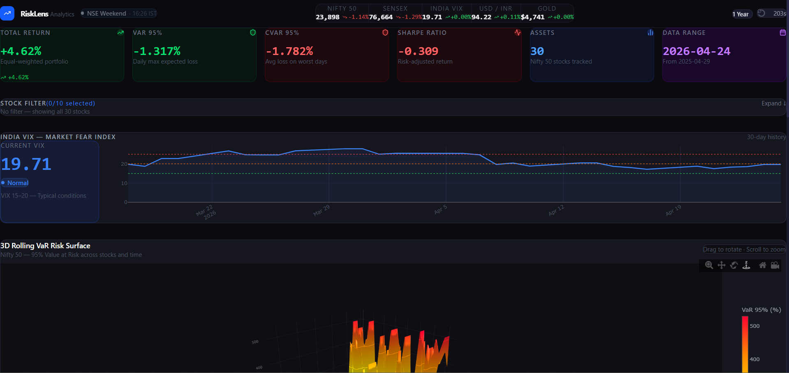
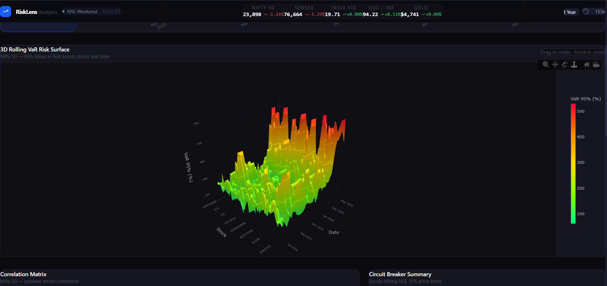
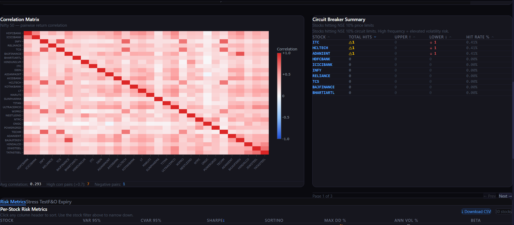
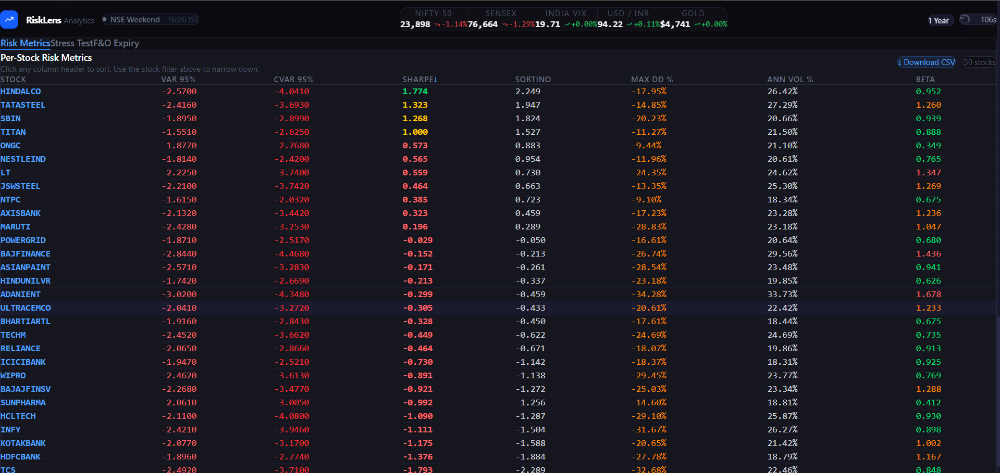

# RiskLens Analytics

> Production-grade quantitative risk platform for Indian equity markets —
> real NSE data, institutional risk metrics, deployed live.

**Live Demo:** https://risklens-analytics-production.up.railway.app  
**API Docs:** https://risklens-analytics-production.up.railway.app/docs  
**GitHub:** https://github.com/Git-HarshitTiwari/RiskLens-Analytics

---

## Screenshots

| Dashboard & Live Prices | 3D Rolling VaR Surface |
|---|---|
|  |  |

| Correlation Matrix | Risk Metrics Table |
|---|---|
|  |  |

---

## What It Does

Tracks all 30 Nifty 50 stocks with real NSE market data and computes
institutional-grade risk metrics — the kind of tool a quant desk or
portfolio risk team would actually use internally.

Built specifically for Indian market structure: RBI repo rate as risk-free
rate, NSE 252-day calendar, SEBI circuit breaker rules, NSE F&O expiry
cycle detection.

---

## Features

| Feature | Details |
|---|---|
| **Risk Metrics** | VaR 95%, CVaR 95%, Sharpe, Sortino, Beta vs Nifty 50, Max Drawdown, Annualized Vol — all 30 stocks |
| **3D Risk Surface** | Interactive rolling VaR surface across stocks x time (Plotly.js) |
| **Live Market Data** | Nifty 50, Sensex, India VIX, USD/INR, Gold — auto-refreshes every 5 min |
| **India VIX Panel** | Regime classification: Calm / Normal / Elevated / High Fear / Extreme Fear |
| **Stress Testing** | COVID crash, GFC 2008, INR depreciation, FII selloff, volatility spike |
| **Correlation Heatmap** | 30x30 pairwise return correlation matrix |
| **Circuit Breakers** | Stocks hitting NSE 10% price limits — frequency and direction |
| **F&O Expiry Effect** | Expiry week volatility premium per stock (e.g. KOTAKBANK +34%) |
| **CSV Export** | Download full risk metrics table |
| **NSE Market Status** | Live Open / Closed / Weekend indicator based on IST |

---

## Tech Stack

| Layer | Technology |
|---|---|
| Risk Engine | Python 3.12, pandas, NumPy, SciPy |
| Backend | FastAPI, Uvicorn, slowapi, pydantic-settings |
| Auth | JWT (python-jose), bcrypt (passlib) |
| Frontend | React 18, Vite, Tailwind CSS, Plotly.js, Axios |
| Data | yfinance (NSE/BSE via Yahoo Finance) |
| Logging | Structured JSON (python-json-logger) |
| Testing | pytest — 13 tests, all passing |
| Deployment | Railway + Nixpacks |
| CI/CD | GitHub Actions (test to build to deploy) |
| Containers | Docker + docker-compose (local dev) |

---

## Architecture

Single service in production — React compiled and served by FastAPI directly.

Browser → FastAPI (port 8000)
├── Serves compiled React (dashboard/frontend/dist/)
├── /auth      JWT login
├── /risk      VaR, CVaR, stress tests
├── /portfolio Summary, correlation matrix
├── /market    VIX, prices, circuit breakers, F&O expiry
├── /export    CSV download
└── /health    Health check
↓
Python Risk Engine (engine/)

---

## Run Locally

```bash
git clone https://github.com/Git-HarshitTiwari/RiskLens-Analytics.git
cd RiskLens-Analytics
python -m venv venv && venv\Scripts\activate
pip install -r requirements.txt
uvicorn api.main:app --reload --port 8000
```

In a second terminal:

```bash
cd dashboard/frontend
npm install && npm run dev
```

- Frontend: http://localhost:3000
- API docs: http://localhost:8000/docs
- Swagger login — Username: admin Password: quantrisk123

---

## CI/CD Pipeline

Push to main triggers GitHub Actions:

1. All 13 pytest tests on Python 3.12
2. React production build verification
3. Auto-deploy to Railway if both pass

The pipeline ensures no broken code ever reaches production.

---

## Indian Market Context

| Parameter | Value |
|---|---|
| Risk-free rate | RBI repo rate 6.5% |
| Trading calendar | 252 days/year (NSE standard) |
| Circuit breakers | NSE 10% daily price movement limits |
| F&O expiry | Last Thursday of each month |
| Benchmark | Nifty 50 (^NSEI) for beta calculations |
| VIX classification | Indian market volatility regimes |

---

*Data via yfinance (NSE). Built for educational and portfolio
demonstration purposes — not for live trading decisions.*

